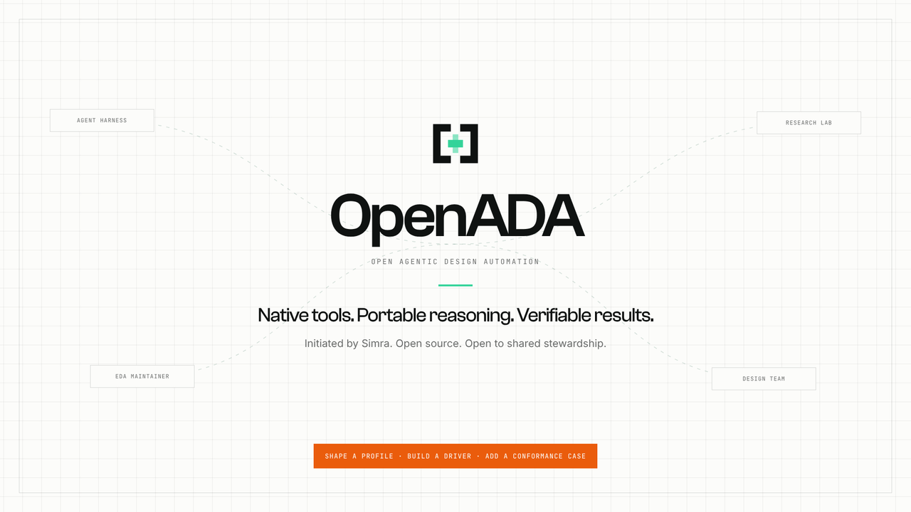

# OpenADA

<p align="center">
  <a href="https://youtu.be/0odnKFsgbt0">
    
  </a>
</p>

<p align="center">
  <a href="https://youtu.be/0odnKFsgbt0"><strong>▶ Watch the 48-second introduction on YouTube</strong></a><br>
  <sub>The open interface between agents and EDA.</sub>
</p>

### Open Agentic Design Automation

**Versioned engineering intent in. Auditable engineering evidence out.**

OpenADA is building the open semantic boundary between design agents and
deterministic EDA tools. An agent states an engineering intent—netlist a
schematic, run a simulation, check DRC, compare LVS—and a driver translates it
into the native tool's CLI, API, files, environment, and run policy. OpenADA
returns compact evidence for the agent's next decision while the native design
files and EDA artifacts remain authoritative.

The goal is one reusable contract across open-source EDA backends, not one
replacement for them. The same simulation intent can run through ngspice or
Xyce; the agent should not have to relearn every command surface and log
grammar to understand whether valid evidence was produced.

The `0.4.0` preview provides sixteen CLI command families, eight open-source EDA
drivers, the versioned `openada.result/v0alpha1` evidence envelope, and nine
agent skills. It closes the first native-artifact-to-specification chain with
verified ngspice/Xyce series extraction and deterministic coherent single-tone
SNR, SINAD, THD, and SFDR measurements, plus closed AC gain, bandwidth,
unity-frequency, and phase-margin evidence. Packaged profiles are inspectable
through the CLI. It also adds a hardened explicit-manifest, local JSON-stdio
external-provider runtime for the active circuit-simulation profile. That
runtime is intentionally not automatic discovery, a marketplace, or an MCP
binding.

> **Early preview**
>
> Interfaces and result schemas may change, and driver maturity varies by tool.
> OpenADA results are engineering evidence, not a substitute for reviewing the
> active PDK, model library, rule deck, tool configuration, or signoff requirements.

## The missing layer

Agents can already invoke raw binaries. The hard part is everything around the
invocation: discovering installations and PDKs, selecting a deterministic
headless mode, preparing tool-specific inputs, interpreting exhaustive logs and
exit codes, finding the current-run artifacts, and retaining enough provenance
to justify the next engineering decision.

OpenADA standardizes that control and evidence boundary. It does **not**
introduce a universal circuit format, replace a PDK, or hide native artifacts.
Data-layer projects may translate design representations; OpenADA defines how
an agent asks for an operation and how a driver reports what actually happened.

## The narrow waist

```text
       Codex · Claude Code · research agents · design automation
                              │
                tool-independent engineering skills
                              │
                  versioned engineering intent
                              ▼
          ┌─────────────────────────────────────┐
          │       OpenADA semantic contract     │
          │ operation · assertion · capability  │
          │ status · evidence · provenance      │
          └─────────────────────────────────────┘
                              │
              deterministic, tool-native drivers
             ┌────────────────┼────────────────┐
             ▼                ▼                ▼
       circuit EDA       layout EDA       digital EDA
             │                │                │
             └────────────────┼────────────────┘
                              ▼
               native files, reports, waveforms
                              │
                  auditable evidence returned
```

The narrow waist is deliberately smaller than any tool CLI. An ngspice, Xyce,
KLayout, Netgen, Yosys, OpenROAD, or LibreLane driver may use many native
primitives to implement one stable engineering operation. Agent harnesses
provide connectivity; OpenADA defines the domain meaning and the evidence
threshold.

Local CLI is the implemented connection today; MCP, live sessions, and remote
jobs are future adapter choices below that meaning. The v0alpha1 driver
manifest now supports explicit validated local invocation, but it does not
define automatic discovery, a normative MCP binding, or per-feature capability
maturity. A future EDA marketplace should catalog providers of exact,
conformance-backed capabilities—not raw binaries or prompt bundles. See
[Providers, marketplaces, and MCP](docs/PROVIDERS_AND_MCP.md).

The [semantic model](docs/SEMANTIC_MODEL.md) specifies this proposed ABI in
more detail: operation and assertion profiles, requests, driver capabilities,
normalized evidence, artifact lineage, and transactional mutation.

OpenADA is not another EDA, an agent harness, or a required container. Local
installations on `PATH` are first-class. Reproducible environments such as
[IIC-OSIC-TOOLS](https://github.com/iic-jku/IIC-OSIC-TOOLS) can be selected as
runtime profiles for demos and conformance testing.

## One intent, different backends

The target contract lets a driver compile one operation profile to different
native mechanisms:

```text
openada.operation/circuit.simulate/v1alpha2
                 │
        ┌────────┴─────────┐
        ▼                  ▼
     ngspice              Xyce
        └────────┬─────────┘
                 ▼
     one normalized evidence contract
```

The alpha proof exposes both drivers through the same command and operation
profile. An explicit `--backend` selects that typed shared-profile path;
omitting it keeps the compatible legacy ngspice interface. A caller may either
let OpenADA inspect the deck's one supported top-level analysis or supply the
closed typed flags explicitly:

```bash
./bin/openada simulate conformance/circuit-simulate-v0alpha2/fixtures/rc-transient.cir \
  --backend ngspice \
  --output-dir /tmp/ngspice-evidence
./bin/openada simulate conformance/circuit-simulate-v0alpha2/fixtures/rc-transient.cir \
  --backend xyce \
  --output-dir /tmp/xyce-evidence
./bin/openada simulate conformance/circuit-simulate-v0alpha2/fixtures/resistor-divider-dc.cir \
  --backend ngspice --analysis dc \
  --source-name VSWEEP --source-unit V --start 0 --stop 1 --step 0.25 \
  --output-dir /tmp/ngspice-dc-evidence
```

The shared subset remains intentionally small: one self-contained OP, DC, AC,
or transient analysis, with no includes, control-language blocks, `.measure`,
`.print`, FFT, noise, Monte Carlo, or mixed-analysis deck. The ngspice mapping
is structured for OP/DC/AC and workflow-validated for TRAN; Xyce is structured
for DC/AC, workflow-validated for TRAN, and explicitly rejects OP as
unsupported. The independent verifier
parses each backend's native raw evidence and checks analysis-specific facts
without requiring identical point counts or native files. Each result still
identifies the selected backend and version, native inputs and artifacts,
working directory, diagnostics, hashes, and provenance.

A passing shared-profile result can now continue without copying waveform
numbers out of a log:

```text
circuit.simulate/v1alpha2
  -> result.series.extract/v1alpha1
  -> result.measure/v1alpha1
     or result.spectral.measure/v1alpha1
     or result.transfer.measure/v1alpha1
  -> specification.evaluate/v1alpha1
```

`openada extract` requires the complete simulation result plus the exact raw
artifact path and explicit native-name/output-name/unit/Cartesian-component
selectors. The three measurement commands accept the complete passing
extraction envelope directly. `openada spectral` implements one deliberately
narrow coherent single-tone method; `openada transfer` implements an explicit
same-unit Cartesian output-over-input trace with closed crossing semantics.
See [Measurement methods and standards
context](docs/MEASUREMENT_METHODS.md) for their methods, IEEE scope map, and
non-conformance boundary.

The contract also keeps distinct questions distinct:

- `execution.status: completed` means the native process ran.
- `engineering.status: pass` means the operation's fixed assertion passed.
- A successful simulation establishes valid analysis evidence; it does not by
  itself establish that the circuit meets its specification.
- DRC clean and LVS match do not establish circuit performance or foundry
  signoff.

That shared boundary creates leverage for the whole ecosystem:

- Agent and harness authors integrate once instead of teaching every model
  every EDA command surface.
- EDA maintainers contribute one conforming driver instead of separate plugins
  for every agent framework.
- Researchers can swap engines or publish reusable workflows without rewriting
  invocation, parsing, and evidence plumbing.
- Design teams receive reviewable native artifacts and provenance instead of an
  agent's unbounded log summary.

## Engineering skills above the contract

Standardizing EDA semantics removes much of the value from teaching an agent a
separate skill for every supported tool. It creates a better place for skills:
reusable engineering workflows that sit above the contract and work across
backends.

The plugin has two deliberately separate layers:

- `skills/openada` is the thin execution and evidence adapter. It selects a
  semantic operation, invokes OpenADA, and interprets the versioned result.
- Eight experimental engineering skills sit above it:
  `review-circuit-simulation`, `characterize-analog-block`,
  `analyze-feedback-stability`, `analyze-spectral-linearity`, and
  `assess-pvt-and-yield`, plus `review-rtl-architecture`,
  `assess-synthesis-and-inference`, and `assess-asic-timing`. They preserve the
  execution/evidence/measurement/specification boundary and inspect advertised
  operations and feature IDs before planning work.
- One separate experimental onboarding coordinator,
  `bootstrap-asic-project`, freezes PDK, runtime, flow, project intent, and
  full-chip collateral. An unavailable primitive is reported as not evaluated
  by default; exploratory native gap work requires explicit authorization and
  remains labeled outside OpenADA result envelopes.

Skills are plugin content, not protocol objects. They may compose several
OpenADA operations and evolve faster than the semantic ABI, but they cannot
redefine an assertion, promote driver maturity, or turn a native log heuristic
into a portable contract. Installing the plugin discovers all shipped skills;
the CLI and JSON contracts remain usable by harnesses that do not support
skills.

See [Engineering skills above OpenADA](docs/ENGINEERING_SKILLS.md) for the
layering rule, plugin structure, initial catalog, maturity model, and
contribution gate.

## Evidence-backed semantic release

Every active semantic command, feature, provider mapping, and preflight route
is derived into a closed coverage row. The current source has 147 active rows,
and release CI requires every one to reach `agent-ready` through one of seven
pinned public-design chains: physical DRC/LVS, analog measurements, the full
inverter agent workflow, all four ngspice-provider analyses, SAR RTL, and
ngspice/Xyce portability, plus ORFS Ibex synthesis and timing.

A release row needs a real native run, independently parsed native artifacts,
normalized evidence, an engineering decision, a trustworthy negative, a
tamper rejection, and an agent-visible result. Every receipt also binds the
exact semantic source and the clean Git tree used during replay. The generated
seven-record index is therefore a release ledger, not a maturity label or a list
of demonstrations.

Run the offline release checks with:

```bash
python tools/semantic_refresh_manifests.py
python tools/semantic_publish_index.py
python tools/verify_semantic_coverage.py --mode release
```

See [Semantic coverage and release gating](docs/SEMANTIC_COVERAGE.md) for the
receipt model and the exact contribution sequence. A newly exposed row blocks
release until its complete chain exists; it cannot borrow evidence from an
adjacent command or be waived through prose.

## What exists and what comes next

| Contract layer | Current checkout | Protocol target |
|---|---|---|
| Agent intent | Sixteen CLI command families; eight fixed scoped-preflight assertions; nine active typed operation profiles plus one historical simulation profile; validated explicit `openada.request/v0alpha1` circuit-simulation dispatch | Remaining immutable profiles plus catalog/session/remote transport revisions |
| Result | Closed `openada.result/v0alpha1` envelope; open operation data | Typed per-operation evidence inside a versioned common envelope |
| Drivers | Eight open-source EDA drivers; circuit simulation, strict RTL lint, mapped synthesis, and synthesis-stage timing expose typed evidence at feature-specific maturity | Capability manifests and independently installable drivers |
| Portability proof | Analysis-specific `circuit.simulate` requests have pinned native ngspice/Xyce success replay with independently parsed artifacts; the expanded replay does not yet cover every maturity outcome | More operations, open-source backends, runtime environments, and complete outcome corpora |
| Engineering skills | One execution skill plus eight experimental capability-gated engineering skills across analog and digital review; one separate experimental ASIC onboarding coordinator | Contributed workflows that compose stable operations across backends |
| Workflow composition | Simulation → verified native series extraction → scalar, coherent spectral, or closed AC transfer measurement → explicit specification evaluation, with digest lineage and the verified extraction envelope retained separately | Integrated noise, corners, statistical campaigns, and richer standard-reviewed methods |
| Design mutation | Deliberately outside the current preview | Preconditioned, transactional change sets with declared writes, native diffs, rollback evidence, and source-revision identity |

Mutation is part of the long-term design because chip projects need safer
change history and collaboration. It must be a stronger contract than “the
tool edited a file”: a mutation should name the expected input revision,
declare its write set, preserve before/after native evidence, and report commit
or rollback separately from engineering validation.

The [mutation and versioning proposal](docs/MUTATION_AND_VERSIONING.md) defines
a semantic, append-only design-change history with `preview`, `apply`, and
`revert`; the write-capable runtime is planned and is not shipped in `0.4.0`.

## Quickstart

Prerequisites: Linux or another POSIX environment, Python 3.10+, and at least
one supported EDA binary.

```bash
git clone https://github.com/simra-tech/OpenADA.git
cd OpenADA
./bin/openada doctor
```

Require the tool needed for a task:

```bash
./bin/openada doctor --tool ngspice --require ngspice
```

For a project-scoped first run, state the project root and one intended
engineering assertion instead of inventorying every tool or project file:

```bash
./bin/openada doctor --project-root . \
  --assertion spice-analysis-evidence-valid
```

Scoped preflight accepts one of eight fixed assertion IDs and selects exactly
one smallest semantic operation:

| Assertion | Tool inspected | Next operation |
|---|---|---|
| `schematic-netlist-generated` | Xschem | `netlist` |
| `spice-analysis-evidence-valid` | ngspice | `simulate` |
| `drc-clean` | KLayout | `drc` |
| `lvs-match` | Netgen | `lvs` |
| `rtl-structural-check-passes` | Yosys | `rtl-check` |
| `rtl-lint-clean` | Verilator | `rtl-lint` |
| `asic-netlist-synthesized` | Yosys | `synthesize` |
| `timing-constraints-satisfied` | OpenSTA | `timing-analyze` |

The result records the canonical root, exact binary/version observation,
runtime profile, configured PDK roots, connector startup policy, and one
singular target. It does not walk the project or PDK catalogs, evaluate the
design assertion, or guess a PDK, rule deck, setup, model library, startup
file, or top cell. Those remain explicit inputs to the recommended operation.
An empty scoped-preflight `data.pdks` means the catalog was not enumerated; it
does not mean that no PDK is installed.

Run the included ngspice fixture when ngspice is installed:

```bash
./bin/openada simulate fixtures/smoke/smoke_ngspice.cir \
  --output-dir /tmp/openada-smoke
```

For control-mode ngspice decks, explicit startup policy, fresh KLayout report
handling, Netgen's report/JSON agreement checks, and the Yosys and Xschem
commands, see the [current driver reference](docs/CURRENT_DRIVERS.md). The
driver-specific safety rules are part of the preview contract; do not infer
them from a raw tool's exit code.

After adding the plugin to an agent, a useful execution-layer first-run prompt
is:

> Use the OpenADA skill in this project. Treat source files and PDKs as
> read-only. Choose one intended engineering assertion and run scoped OpenADA
> preflight for this project root. If the exact required project collateral is
> known, run the one recommended semantic operation into
> a task-local evidence directory. Report execution status separately from the
> engineering status, then list the selected tool/version, diagnostics,
> artifact paths and hashes, and any provenance limitation. Do not substitute
> a generic PDK, model library, DRC deck, LVS setup, or top cell to get a pass.

For a blank ASIC workspace where the PDK or compatible runtime is not already
frozen, start with the dedicated coordinator instead:

> Use `$openada:bootstrap-asic-project` to define whether this is a core or a
> full-chip candidate, inspect bounded configured resources, choose one coherent
> open-PDK/toolchain stack, and freeze `.openada/bootstrap-manifest.json` before
> an expensive run. Prefer an already-present pinned runtime over downloading
> unrelated tools. Stage-gate RTL, function, synthesis, implementation, timing,
> padframe, DRC, LVS, and handoff; keep unsupported native work and foundry
> acceptance outside OpenADA claims.

To install the Python entry point from the current checkout:

```bash
python -m pip install .
openada doctor
```

Until the `v0.4.0` release tag is published, a remote source install can track
the reviewed default branch with
`python -m pip install 'git+https://github.com/simra-tech/OpenADA.git@main'`.
For a reproducible deployment, replace `main` with a reviewed 40-character
commit and use the matching plugin ref. Do not request the not-yet-published
`v0.4.0` tag.

## Add the agent skills

The plugin ships every directory under `skills/`: the OpenADA execution skill
and focused engineering skills above it. The same packages are shared across
harnesses. Agent marketplaces install those skill files, but do not install the
Python package or its `jsonschema>=4.18` runtime dependency. Install the Python
entry point from the same OpenADA release using the command above before asking
the plugin to execute or inspect semantic profiles. The bundled `bin/openada`
launcher remains useful from a source/plugin checkout whose Python dependencies
are already available; schema-backed commands otherwise return a structured
missing-dependency diagnostic instead of a traceback (profile/provider
validation uses `provider.validation.unavailable`).

### Claude Code

Inside Claude Code:

```text
/plugin marketplace add https://github.com/simra-tech/OpenADA.git
/plugin install openada@openada
/reload-plugins
```

While `v0.4.0` is unreleased, the command above follows the repository's
default branch; replace it with a reviewed commit when the client supports a
Git ref suffix. Start a new conversation after installation so the bundled
skills are loaded.

Restart Claude Code instead if the plugin is not visible after reloading.

Invoke the plugin skills as `/openada:openada`,
`/openada:bootstrap-asic-project`, `/openada:characterize-analog-block`, or another shipped
`/openada:<skill-name>` command.

For local development without installation:

```bash
claude --plugin-dir .
```

### Codex

Add the Git marketplace:

```bash
codex plugin marketplace add simra-tech/OpenADA --ref main
codex plugin add openada@openada
```

Replace `main` with a reviewed commit or published release tag when pinning a
deployment, then start a new Codex session. `/plugins` shows the configured
marketplace and installed plugin in the CLI.

Invoke the plugin skills as `$openada:openada`,
`$openada:bootstrap-asic-project`, `$openada:characterize-analog-block`, or another shipped
`$openada:<skill-name>` skill.

For a skill-only Codex CLI setup, first install the `openada` Python entry point
as shown above. Then install every shipped skill directory into the user skill
directory:

```bash
mkdir -p ~/.agents/skills
for skill in skills/*; do
  cp -R "$skill" ~/.agents/skills/
done
```

### Other harnesses

Make `bin/openada` available to the agent's terminal and register the desired
`skills/*/SKILL.md` packages using the harness's Agent Skills mechanism. Start
with `skills/openada`, then add the engineering workflows relevant to the
project. The CLI is the portable contract; the harness adapter should stay
thin.

### Hermes

An OpenADA release produces two Python wheels from one immutable repository
revision: the evidence-attested `openada` runtime and the separate
`openada-hermes-plugin` adapter under `integrations/hermes`. Install both at
the same version. The adapter depends on that exact `openada` version and
exposes a thin `hermes_agent.plugins` entry point named `openada`.

Hermes discovers the adapter on its next startup and registers every shipped
skill as an advertised, read-only `openada:<skill-name>` skill. Add `openada`
to `plugins.enabled` when the host uses an explicit plugin allowlist, then
start a new conversation so its stable skill index includes the plugin.

The adapter wheel copies the canonical root `skills/` tree at build time. It
does not register model tools, wrap native EDA executables, or change the
OpenADA CLI contract. Production must build and install both wheels from the
same reviewed commit rather than mixing runtime and skill revisions.

## Preview operations

| Operation | Native tool | Maturity | Preview behavior |
|---|---|---|---|
| `doctor` | runtime | preview | Discover capabilities, or preflight one project assertion without catalog inventory |
| `netlist` | Xschem | workflow-validated | Produce a SPICE netlist and fail on recognized unresolved symbols |
| `simulate` (legacy default) | ngspice | workflow-validated | Stream wrapper raw files in batch mode, or validate declared deck-owned raw/`wrdata` outputs in control mode |
| `simulate --backend ngspice` | ngspice | structured OP/DC/AC; workflow-validated TRAN | Run one self-contained OP, DC, AC, or transient analysis and emit typed `circuit.simulate` facts |
| `simulate --backend xyce` | Xyce | structured DC/AC; workflow-validated TRAN | Run one self-contained DC, AC, or transient analysis; OP is explicitly unsupported |
| `extract` | deterministic Spice3 kernel | structured alpha | Verify one exact passing shared-simulation artifact and project explicit real/imaginary native vector components into a canonical real series |
| `measure` | deterministic OpenADA kernel | structured alpha | Derive one typed scalar from a canonical-digest-bound normalized real inline series using a closed algorithm kind |
| `spectral` | deterministic OpenADA kernel | structured alpha | Derive coherent single-tone SNR, SINAD, signed-dB THD, or SFDR from one fully declared hashed bin partition |
| `transfer` | deterministic OpenADA kernel | structured alpha | Derive first-positive-frequency gain, unique falling −3 dB bandwidth, unity-gain frequency, or explicitly declared negative-feedback phase margin; retain the complete magnitude/phase trace |
| `evaluate` | deterministic OpenADA kernel | structured alpha | Read a complete ordinary, spectral, or transfer measurement envelope, then compare its typed scalar with exact-unit bounds and explicit condition bindings |
| `profile list/show` | installed contracts | preview | List packaged operation/assertion/feature IDs or emit one complete schema-bearing operation profile from any working directory |
| `provider validate/list/invoke` | external local CLI | structured runtime boundary | Validate one explicit v0alpha1 manifest/request and invoke one active `circuit.simulate/v1alpha2` JSON-stdio wait capability; snapshot canonical request inputs within fixed target/configuration/aggregate bounds, and enforce status/evidence truth, artifact identity, zero transport exit, and descendant cleanup |
| `drc` | KLayout | workflow-validated | Validate one exact fresh deck-owned `.lyrdb`, weighted violations, and bounded transcript evidence |
| `drc-review` | KLayout | diagnostic preview | Render hashed full-layout and ranked hierarchical cluster PNGs from one validated existing `.lyrdb` and its exact GDS; does not re-run or replace DRC |
| `lvs` | Netgen | workflow-validated | Validate agreeing fresh native report/JSON plus a clean bounded setup transcript |
| `rtl-check` | Yosys | structured alpha | Elaborate SystemVerilog/Verilog and run structural checks |
| `rtl-lint` | Verilator | workflow-validated | Apply a strict no-warning/no-error SystemVerilog lint assertion with hashed source/include evidence |
| `synthesize` | Yosys + ABC | workflow-validated | Bind the external ABC executable by version and digest, retain generic inference facts, and validate a complete flattened Liberty-mapped ASIC netlist |
| `timing-analyze` | OpenSTA | workflow-validated | Validate constraints and report one-corner setup/hold WNS, TNS, and bounded critical paths in seconds |

Magic, OpenROAD, Icarus Verilog, Surelog, standalone slang, OpenVAF,
Qucs-S, GTKWave, and LibreLane are currently discoverable but do not yet have a
stable structured operation in the preview contract.

Xschem-to-ngspice simulation, KLayout DRC, and Netgen LVS pass pinned public IHP
inverter conformance cases. Strict Verilator lint passes the public IHP SAR RTL,
and Yosys/Slang synthesis plus OpenSTA timing are replayed on pinned ORFS Ibex
RTL and Nangate45 collateral. The roadmap preserves the boundary between this
synthesis-stage evidence and physical or signoff closure.

See [the current result contract](docs/CONTRACT.md),
[semantic model](docs/SEMANTIC_MODEL.md),
[engineering skills](docs/ENGINEERING_SKILLS.md),
[request and driver protocol](docs/DRIVER_PROTOCOL.md),
[providers, marketplaces, and MCP](docs/PROVIDERS_AND_MCP.md),
[measurement methods and standards](docs/MEASUREMENT_METHODS.md),
[compatibility policy](docs/COMPATIBILITY.md),
[release history](CHANGELOG.md),
[driver status and roadmap](docs/ROADMAP.md), and
[contribution guide](CONTRIBUTING.md). Driver contributors can check captured
results with the [small conformance kit](conformance/driver-kit/README.md).

## Reproduce the native ngspice + Xyce proof

The smallest portability replay uses the model-free RC fixture already in this
repository and the pinned linux/amd64 IIC-OSIC-TOOLS `2026.06` image. Both EDA
runs are network-disabled with a read-only repository mount and fresh evidence
directory:

```bash
python3 conformance/circuit-simulate-v0alpha2/run.py \
  --evidence-dir /tmp/openada-circuit-simulate-evidence
python3 conformance/circuit-simulate-v0alpha2/verify.py \
  /tmp/openada-circuit-simulate-evidence
```

The replay requires the exact pinned image to exist locally and never pulls it
during EDA execution. See the
[circuit-simulation conformance guide](conformance/circuit-simulate-v0alpha2/README.md)
for the image identity, assertion boundary, and independent checks.

## Reproduce the pinned DRC + LVS case

The first public conformance workflow fetches an exact Apache-2.0 IHP
AnalogAcademy revision and runs KLayout DRC plus Netgen LVS in the pinned
linux/amd64 IIC-OSIC-TOOLS image. Setup may use the network; both EDA operations
run with networking disabled, read-only source/design mounts, and a fresh
writable evidence directory.

```bash
python3 -m venv .venv
. .venv/bin/activate
python -m pip install -e '.[conformance]'
python3 conformance/ihp-inverter/setup.py
python3 conformance/ihp-inverter/run.py \
  --evidence-dir /tmp/openada-ihp-inverter-evidence
python3 conformance/ihp-inverter/verify.py \
  /tmp/openada-ihp-inverter-evidence
```

See the [IHP inverter conformance guide](conformance/ihp-inverter/README.md) for
the pinned image/design identities, expected assertions, and storage needs. No
PDK, third-party design, or generated evidence is vendored into OpenADA.

The separate [IHP Xschem-to-ngspice guide](conformance/ihp-inverter-ngspice/README.md)
replays schematic netlisting and the explicit deck-owned raw contract, then
independently checks finite transient waveforms, supply bounds, and inverter
logic behavior:

```bash
python3 conformance/ihp-inverter-ngspice/setup.py
python3 conformance/ihp-inverter-ngspice/run.py \
  --evidence-dir /tmp/openada-ihp-ngspice-evidence
python3 conformance/ihp-inverter-ngspice/verify.py \
  /tmp/openada-ihp-ngspice-evidence
```

## Evaluate the agent contract without inventing a benchmark

The [paired agent evaluation kit](evaluation/paired-agent/README.md) freezes an
identical IHP inverter task for a raw terminal condition and an OpenADA
condition. It preassigns interleaved pairs, reduces agent events to
content-free action/status buckets, independently parses the native netlist,
log, and binary waveform, seals assembled rows with a campaign Ed25519 key,
accounts for every planned outcome, and reports metric-specific eligibility.
The campaign binds the exact harness, adapter, runtime binaries, canonical task
bytes, and a per-file treatment-bundle manifest. Both conditions may receive
the neutral evaluation task and submission schema; the raw condition excludes
the OpenADA distribution, CLI, package, result schema, skill, repository,
prior output, and injected context. The kit contains no trial results and makes
no claim that OpenADA is faster or more reliable. Its primary outcome is
verified artifact completeness, not a claim that a trusted observer saw the
native processes generate those bytes.

The first version is offline and bring-your-own-trace. It does not launch a
model or handle credentials. A claim-eligible live adapter must keep provider
credentials in an API-connected supervisor while brokering EDA actions into a
separate network-disabled executor; running an agent on this development host
cannot prove that the raw condition lacks access to OpenADA. The offline
contract requires one attempt per assignment plus explicit dispatch, shared
monotonic-clock, complete-pair, condition-presence, and isolation observations;
missing or conflicting rows refuse comparison but remain in condition-level
intention-to-treat accounting. Missing provider request telemetry remains
unknown and cannot be repurposed as a latency or API retry measurement, while
independently verified engineering outcomes retain their own evidence status.

Plans declare the fixed `hmac-sha256-fisher-yates-v1` randomization algorithm.
The publisher signs both sanitized trial rows and the final summary; the summary
contains deterministic plan-ordered commitments to every supplied plan-bound
row. The public verifier's summary-only mode authenticates that publisher
output but cannot recompute its claims. Full verification requires the exact campaign,
plan, and every sealed sanitized row and recomputes the summary semantics.
Public comparison claims should publish that complete sanitized bundle despite
its residual pair/condition linkability; raw event captures and supervisor
records remain restricted.

Each campaign also freezes a fresh random clock-domain nonce and requires
first-dispatch-zero, campaign-relative monotonic values; public rows must never
carry host-boot or reusable machine clock identities. Sanitized rows still
carry residual fingerprints such as native artifact hashes, relative timing,
usage totals, and pair membership.

## Engineering invariants

- Native EDA files remain authoritative.
- Commands execute as argv vectors without a shell.
- Process completion never implies DRC clean, LVS match, or simulation convergence.
- Returned text and violation lists are bounded; full artifacts remain on disk.
- Inputs and generated artifacts carry SHA-256 hashes.
- A container profile may improve reproducibility, but it is not the architecture.

## Project status

The initial implementation consolidates reusable open-source EDA integration
work. OpenADA remains harness-neutral and open source.

No institutional collaboration or endorsement is implied by support for a
tool, PDK, design, or runtime profile.

## License

MIT. See [LICENSE](LICENSE)
